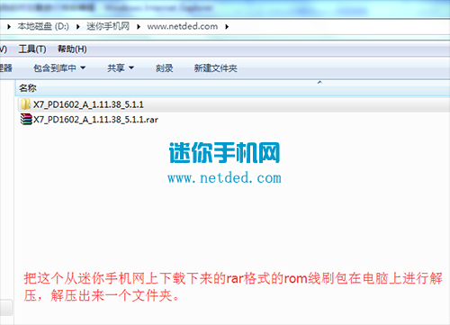
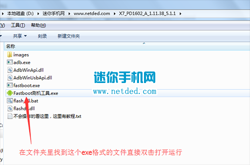
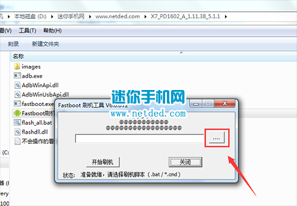
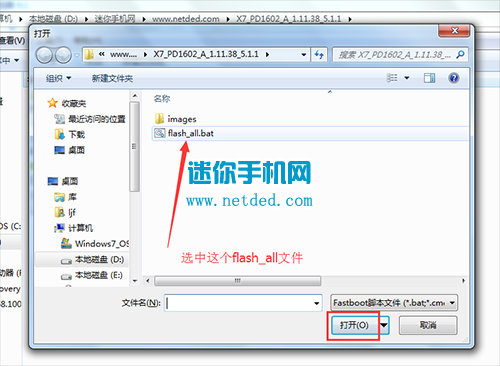
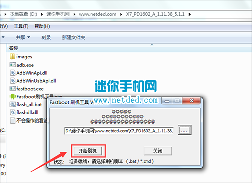

# vivo-x7-crack
> Vivo x7 crack notes.

## 背景：
```conf
亲测过的，X7手机锁屏密码或是VIVO账户密码一旦忘记了，无法自行找回密码的话
只能通过电脑端线刷一下VIVO X7官方固件的方式来解锁清除相关密码后使用了
```

## 准备工具：
- 准备好数据线，一会儿要数据线连接电脑和手机 (通用 android 线即可)
- 云盘里的工具箱：全部/006-Software/Phone Files/vivo-x7/`vivo_X7_PD1602_A_3.6.10_Android 5.1.1. 官方原厂线刷包.zip`


## 步骤：
1. 准备好数据线，一会儿要数据线连接电脑和手机
2. 下载rom线刷包，点击下载A_3.6.10版，把下载下来的rom线刷包先进行解压，直接放到电脑的D盘根目录下解压.
3. 在解压出来的文件夹里直接找到exe格式的文件【Fastboot刷机工具.exe】直接双击打开开运行
4. 然后点击右边【...】按钮，选中刚才解压出来的线刷包的rom文件夹里的【flash_all.bat】文件，然后点击确定
5. 手机要进入刷机模式，进入的方法:手机在关机状态下，按住手机的音量减少键 + 开机键进入刷机模式，接着用数据线连接好电脑.
6. 然后点击【开始刷机】，软件识别出手机之后就开始给手机线刷了。
7. 线刷时间根据每人电脑不同有长有短，过一会界面显示【刷机完成】，就表示线刷成功，重启手机即可。
8. 刷机完成，静等手机开机即可，刷机之后首次开机较慢，耐心等待

## 图文：
<center>
    <p></p>
    <p></p>
    <p></p>
    <p></p>
    <p></p>
</center>

## resources:
+ http://www.netded.com/a/jingpinshouji/2016/0802/31937.html

## keywords: 
```conf
vivo x7 线刷
```